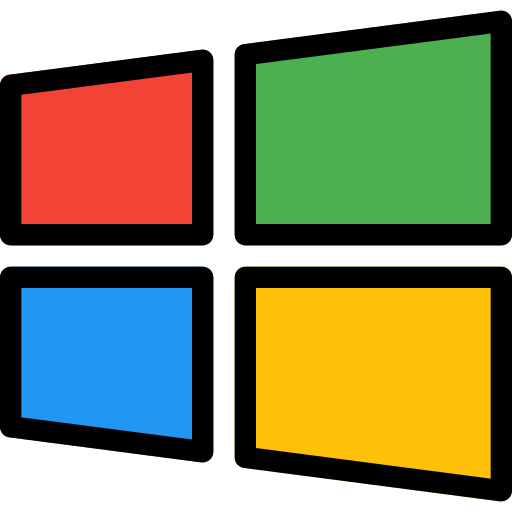

<!--<h1>Hi there, I am <a href="https://www.instagram.com/akshitsood_978/" target="_blank">Akshit</a> 🙋🏽‍♂️</h1> 

 

I'm an enthusiastic Techie and a Developer who loves to contribute to the Opensource Community.
Love python.

---

 ## My Skills 

 **Languages and Frameworks**
 
 ||||||
 |--|--|--|--|--|--|
 
 **Tools**
 
  ||||
 |--|--|--|--|

 **📫 How to reach me:**
---

     
 |--|
 
 
 

**akshit-sood/akshit-sood** is a ✨ _special_ ✨ repository because its `README.md` (this file) appears on your GitHub profile.

Here are some ideas to get you started:

- 🔭 I’m currently working on ...
- 
- 👯 I’m looking to collaborate on ...
- 🤔 I’m looking for help with ...
- 💬 Ask me about ...
- 
- 😄 Pronouns: ...
- ⚡ Fun fact: ...
-->

<h1 align="center">Hi 👋, I'm Akshit sood</h1>
<h3 align="center">A passionate dot net developer from India</h3>

  

- 🔭 I’m currently working on **DCI**

- 🌱 I’m currently learning **node JS, Tailwind CSS**

- 💬 Ask me about **HTML, CSS, JS, Dot Net, C, C++**

- 📫 How to reach me **akshitsood978@gmail.com**

<h3 align="left">Connect with me:</h3>

<h3 align="left">Languages and Tools:</h3>

                     

